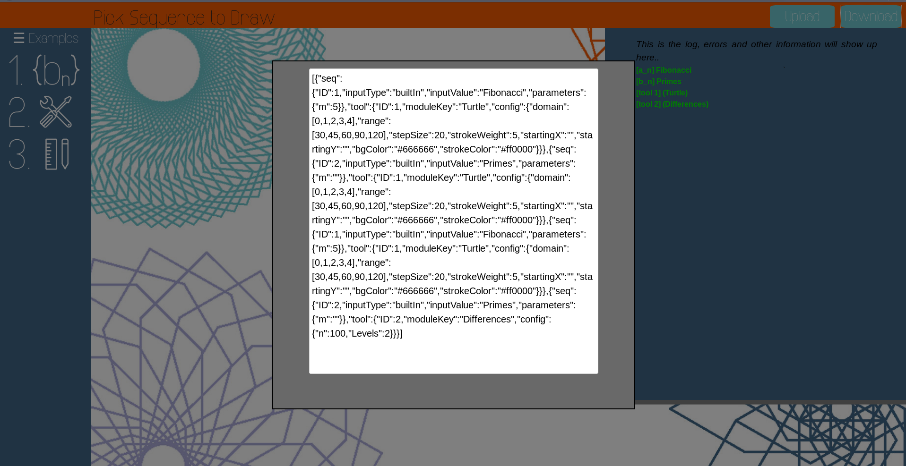

## **Table of Contents**
- [**Building**](#building)
    - [**Requirements**](#requirements)
    - [**Commands**](#commands)
- [**Testing**](#testing)
    - [**What the tests *can* tell you (for now)**](#what-the-tests-can-tell-you-for-now)
    - [**What the tests *can't* tell you**:](#what-the-tests-cant-tell-you)
- [**Saving and loading**](#saving-and-loading)
- [**Trying out ideas quickly:**](#trying-out-ideas-quickly)
- [**Scripts available**](#scripts-available)
- [**Important files and folders:**](#important-files-and-folders)
- [**Creating modules and sequences:**](#creating-modules-and-sequences)
- [**Javascript note**](#javascript-note)

# **Building**

### **Requirements**

- Node
- NPM
- Python3 (for scripts)

### **Commands**

Inside the numberscope directory, run the following command to install NPM dependencies.

```
$ npm install
```

If you change any of the javascript files besides *toolPage.js*, you must rebuild NScore_bundle.js:
  
```
$ npm run watch
```
This will begin watching for any changes to those files and automatically rebuilding the NScore_bundle.js file. Alternatively, to rebuild manually run
```
$ npm run build
```
If you're working on toolpage.js no building is needed, it's included as is in the toolpage.html.

# **Testing**

Since we're testing code that requires the browser context, we'll use [mocha](https://mochajs.org/) in the browser. To the run test simply open *tests/tests.html* in any browser. You'll get a checklist of what tests pass and often useful messages if a test fails. This will help you when you write a module or a sequence by eliminating the common errors. Right now the tests only cover drawing modules, tests for sequences will follow soon. 

**For your module to be visible to the tests, it must be registered with the MODULES object in modules.js, otherwise you won't see it on the checklist**

### **What the tests *can* tell you (for now)**
1. Whether your module's exported object has the required structure and properties.
2. Whether you (incorrectly) use global p5 properties and methods instead of using the *this.sketch* handle instead (there is no global p5 object).
3. Whether your trying to treat *this.seq* as an array by indexing it, instead of treating it like a SequenceGenerator and using *this.seq.getElement* instead. (The test will be extended to check for incorrect calls to *this.seq.length*)

### **What the tests *can't* tell you**:

Probably the most important part: Whether your module will actually work in the browser. You have to actually run it, and if it breaks something look at the browser's console for clues.

# **Saving and loading**

Once you've chosen your sequences and your drawing tools with all their parameters and configs (if there are any), and you've paired them up to your liking in the final stage, you can click the upper right *download* button and it will open up a dialog with a confusing stream of text like this for example:



This is a *JSON* string, it holds information about the way you've arranged and setup your sequences and tools. You can then later on load it by clicking the *upload* button, pasting the JSON, and clicking the *load* button. It will setup everything like it was saved.


# **Trying out ideas quickly:**

Make sure to run "npm run init_module" (or sequence) so that your drawing module is added to the MODULES registry. Then in the sandbox folder there is a *setup.js* file. Here is an example sandbox setup:
```javascript
setup ={
    sequence: 'Fibonacci',
    seqtype: 'builtIn',
    parameters: {
        m: 5 // '' means empty argument
    },
    moduleKey: 'Differences',
    config: {
        n: 20,
        Levels: 2
    },
}
```
Going line by line:
```javascript
  sequence: 'Fibonacci',
```
We're choosing the fibonacci sequence.
```javascript
  seqtype: 'builtIn',
```
The fibonacci is a built in sequence, we could alterntaively use *seqtype: "OEIS"* and *sequence: 'A000045'*.
```javascript
    parameters: {
        m: 5 // '' means empty argument
    },
```
Built in sequences sometimes require parameters. Fibonacci has a parameter *m* which specifies a number to mod the sequence by. (We could've left it empty by replacing 5 with '')
```javascript
    moduleKey: 'Differences',
```
This is where your module key goes, i.e is the string between brackets in *modules.js*, which the MODULES registry uses to identify your module (MODULES['myModuleKEy']).
```javascript
    config: {
        n: 20,
        Levels: 2
    },
```
Finally, if your drawing module depends on certain input defined by the schema, you can provide it with the config object.

Once you're satisfied with your setup object, you can open sandbox.html and it'll run the your drawing module with the selected sequence automatically. This makes debugging quick, since you can change the code and just refresh the page to see the change immediately. It's a good idea to use *console.log* to inspect your code state when you're stuck.

# **Scripts available**

- "**npm run build**": Build the NScore_bundled.js file.
- "**npm run watch**": Watch for changes that affect NScore.js and automatically build NScore_bundled.js 
- "**npm run init_module**": This will ask you for a name and description then it will create a file for you in the modules directory with the minimal appropriate structure required. It will also register the module by adding a line in the modules.js that includes it in the MODULES object.
- "**npm run init_sequence**": The same but for creating a sequence. The sequence entry is added to the BuiltInSeqs object in *javascript/sequences/sequences.js*.

# **Important files and folders:**

- **website/javascript/modules**: this is where the drawing modules are stored
- **website/javascript/modules/modules.js**: this file stores the MODULES object which acts as a registry for the drawing tools implemented. Adding a drawing module to the MODULES object automatically makes it available on the website.
- **website/javascript/NScore.js**: Numberscore's core javascript file, it handles processing the input from the interface, instantiating modules, creating and starting sketches.
- **website/javascript/Validation.js**: All the validation and processing of the drawing configs and sequences inputs happen here before they're prepared by NScore.
- **website/javascript/sequences/**: this is where all the built in sequences are stored.
- **website/javascript/sequences/sequence.js**: This file contains the sequenceGenerator class and other helper functions for sequences, as well as the builtInSeqeunce which acts as a registry for implemented sequence.
- **website/javascript/toolpage/toolPage.js**: this file holds the logic for the website interface.


# **Creating modules and sequences:**

Consult the wiki for the following:
- [Modules](https://github.com/katestange/Numberscope/wiki/Modules)
- [Sequences](https://github.com/katestange/Numberscope/wiki/Sequences)


# **Javascript note**
Javascript makes it very easy to make mistakes, especially ones that go unnoticed. I **strongly** encourage you to use a linter like JShint. You can have it installed with "npm install -g JShint". The best way to use it is to have an editor extension for it that automatically lints your code as you write it. Also, semicolons in javascript seem optional (the engine automatically places it for you if you omit it), until they're not and end up breaking your code. For example
```javascript
let x = 10
let y = 20
(x+y)*2
```
Try running the above code. The paranthesis on the 3rd line tricks the engine into thinking that 2nd line is a function and the 3rd line is its argument. So it'll end up processing the code like this:
```javascript
let x = 10;
let y = 20(x+y)*2;
```
This kind of bug is really frustrating to debug so best to avoid it by explicitly using semicolons.

**Please let me know if there are any bugs, there are bound to be plenty. Feel free to create an issue if one doesn't exist**
