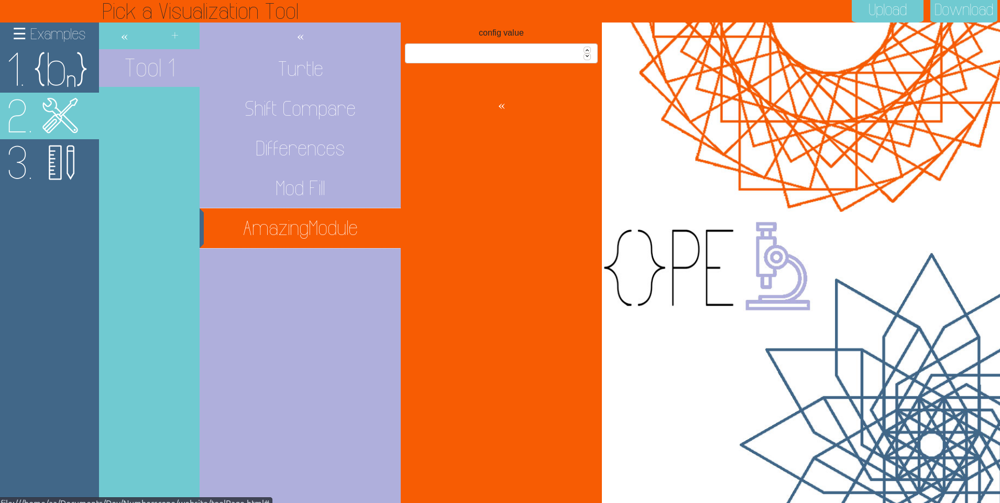

# Requirements

- Node
- NPM
- Python3 (for scripts)

# Setup

If you just downloaded the numberscope directory, run:

```
$ npm install
```

If you want to work on any of the following:
- sequences
- modules
- NScore.js
  
You must run
```
$ npm run watch
```
This will begin watching for any changes to those files and automatically rebuilding the NScore_bundle.js file. Alternatively, to rebuild manually run
```
$ npm run build
```
If you're working on toolpage.js no building is needed, it's included as is in the toolpage.html.

The reason for the build process is the fact that all "import thing from './thing.js' have been changed to 'thing = require('./thing.js')'. This is for two reasons: 

1. ES6 modules (import thing from 'thing.js') don't work if you serve them directly via the file system (e.g opening toolPage.html in in firefox directly), you have to serve them via a server for them to work properly. By using a bundler like browserify the end product (NScore_bundled.js) can be treated as a normal JS script. This way you don't have to start up a server everytime you want to test something out.
2. Makes it much easier to run automated testing (which is a work in progress).


# Modules

(We should probably call this something other than modules since that also refers to javascript ES6 modules)

Lets go through creating a module
```
$ npm run init_module
Enter a viz name: amazingModule
Enter description: does amazing things
1. Generating source..
2. Creating file: javascript/modules/moduleAmazingModule.js
3. Adding module entry in javascript/modules/modules.js
Done!
```

Lets go to **javascript/modules/moduleAmazingModule.js** and examine what was created. The module minimally requires the following:

## Visualization class:
```javascript
class VIZ_AmazingModule {
    constructor(seq, sketch, config){
        this.seq = seq
        this.sketch = sketch

    }
    setup(){

    }
    draw(){

    }
}
```
The constructor has three parameters
```javascript
constructor(seq, sketch, config)
```
- *seq*: This is an instance of SequenceGenerator, it is **not a list**, and can't be accessed with the brackets [], but provides a method seq.getElement(n) that returns the nth number.
- *sketch*: There is no global p5 instance, *sketch* is the only way to call p5 functions and access properties, the reason we do this is to be able to draw an arbitrary number of canvases at the same time. 
- *config*: This is where you will receive all the config values specific to your drawing tool, defined via a schema, which is the second thing module file must have.

## Schema:

```javascript
const SCHEMA_AmazingModule = {

}
```
This is where we define the config values our viz class wants to use. Say for example we want to get a **number** called *myconfigvalue*:
```javascript
const SCHEMA_AmazingModule = {
        myconfigvalue: {
          type: 'number',
          title: 'config value',
    }
}
```
This will generate in the user interface the following:



Which can then be accessed like so:
```javascript
this.val = config.myconfigvalue
```
Notice that the keys in *SCHEMA_AmazingModule* become properties of the config parameter passed to the *VIZ_AmazingModule* constructor. This way makes it's very easy to declaretively say "I want so and so config values" without having to write the HTML interface or extract the values yourself. You define in SCHEMA and expect it in config. (This is thanks to [JSONform](https://github.com/jsonform/jsonform)).  Look at the other module files to various ways to declare your SCHEMA, you can specify more things than just type and title.


## A module object
```javascript
const MODULE_AmazingModule = {
    viz: VIZ_AmazingModule,
    name: 'AmazingModule',
    description: '',
    configSchema: SCHEMA_AmazingModule
}
```
This is where the various parts of the module are collected into one place, NScore can then instantiate the module via *MODULE_AmazingModule.viz*, it knows how that it requires the config defined in *MODULE_AmazingModule.configSchema*, and it'll display the name in defined in *MODULE_AmazingModule.name*. 

Note: Right now there is no validation on the inputs, but if a config.value is "" that means it was left empty. 

## Export
```
module.exports = MODULE_AmazingModule
```
This line is necessary to make this module importable. 
## Registering the module in module.js

The final part is the following line
```javascript
MODULES['AmazingModule'] = require('./moduleAmazingModule.js')
```
is appended to **javascript/modules/modules.js**. NScore uses the *MODULES* object to know what modules are available. All these steps can be done manually or via the npm commanded provided.

# SequenceGenerator class

The basic abstraction over a sequence is the SequenceGenerator class (in **javascript/sequences/sequence.js**). The class has 4 properties 
```javascript
      this.generator = generator;
      this.ID = ID;
      this.cache = [];
      this.newSize = 1;
```
- *generator*: A function that generates the nth number of the sequence. (Must be an $\mathbb{N}\rightarrow\mathbb{N}$ function)
- *ID*: ID is used for bookkeeping by NScore.
- *cache*: A cache to store previously calculated values, useful to avoid expensive calculations and allow memoization.
- *newSize*: Helps resizing the cache.

Methods:
- *resizeCache(n) -> void*: Either doubles the newSize or sets it to n.
- *fillCache(n) -> void*: Fills the cache from the last element *this.cache.length - 1* up to *n*.
- *getElement(n) -> number (or undefined)*: This is really the only method modules should call, it returns the nth element of the sequence. It checks the cache and if it misses it populates the cache.

There is no way to get the length of the sequence since some (or really most that we care about) sequences are infinite. When getElement returns undefined that means there are no more elements to return. 

Additionally the OEISSequenceGenerator defines additional methods since it depends on an external sage server:

- *oeisFetch(n) -> Array(number)*: Sends sage code to http://aleph.sagemath.org/service that returns a list numbers for the given OEIS sequence. 
- *async prefillCache() -> void*: When the sequence is instantiated, we use this method to fill the cache asynchronously since a getting the code from another server is a very expensive operation, right now we prefill with 3000 elements.

Unfortunately if we get a cache miss (3001th element) we have to make a blocking request to get more elements. Otherwise we'd have to make getElement an asynchronously method which would make it more complicated to implement modules. Some possible alternatives:
1. Making an async call when we're near but no at the cache's end, for example *cache.length - 500*, that way modules can continue to call getElement since we have 500 caches hits before missing (this is assuming the module is calling getElement in normal order 1,2,3,4,..), and we'd be pulling more elements in the background. There is an edge case where the module goes through the 500 elements before the request to the sage server is completed but we can probably block until it completes if we hit this case.
2. Prefill the cache with huge amount of elements (20000-30000).

The valid OEIS codes are the ones defined in validOEIS scraped from https://github.com/sagemath/sagelib/blob/master/sage/combinat/sloane_functions.py
The list method is the only one that seems to be consistently working for the different sequences.
# Built in sequences

- to be added

# Testing

- to be added

---

NPM scripts you can run

- "**npm run build**": Build the NScore_bundled.js file.
- "**npm run watch**": Watch for changes that affect NScore.js and automatically build NScore_bundled.js 
- "**npm run check_module [file]**": A lot of the drawing tools that were converted to our module format were forgetting to change some parts that were using global p5 methods and instances (for example "line" or "background"), which should instead use the handle "sketch" (like "sketch.line" and "sketch.background"). Running this tool will scan the file for any usage of p5 keywords without *this.sketch*, but ***it can detect something that has nothing to do with p5 and if so just ignore it*** (e.g if you name a variable "line" you're fine, if you're using the p5 function "line" you should change it, the script can't tell the differences. It's good to run and go through line by line to make sure. )
- "**npm run init_module**": This will ask you for a name and description then it will create a file for you in the modules directory with the minimal appropriate structure required. It will also register the module by adding a line in the modules.js that includes it in the MODULES object.
- "**npm run init_sequence**": The same but for creating a sequence. The sequence entry is added to the BuiltInSeqs object in *javascript/sequences/sequences.js*.

---

Important files and folders:
- **javascript/modules**: this is where the drawing modules are stored
- **javascript/modules/modules.js**: there is an object called MODULES which holds all the modules, once a new module is added to the directory, it must be imported in modules.js and also added to the MODULES object. 
- **javascript/NScore.js**: Numberscore's core javascript file, it handles processing the input from the interface, instantiating modules, creating and starting sketches.
- **javascript/sequences/**: this is where all the build in sequences are stored.
- **javascript/sequences/sequence.js**: This file contains the sequenceGenerator class and other helper functions for sequences.
- **javascript/toolpage/toolPage.js**: this file holds the logic for the website interface.

Things that need to get done:
- ~~Implement other input method for sequence~~
- Convert the TA-visualizers to the module format
- Implement error-handling mechanism for sequence parameters and viz configs.
- Layout of the sketches acts weird when the browser is resized (actually it's weird in general, in chrome the elements are huge)
- ~~A pause button to pause all the sketches~~ 
- builtin examples of sequence/tool pairings
- some sort of testing environment to help when writing the modules

